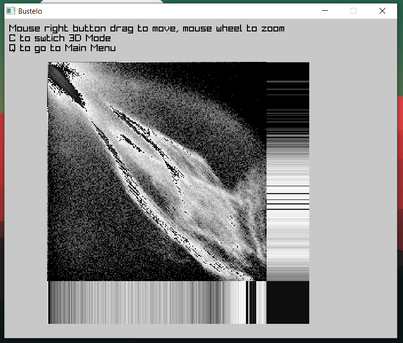
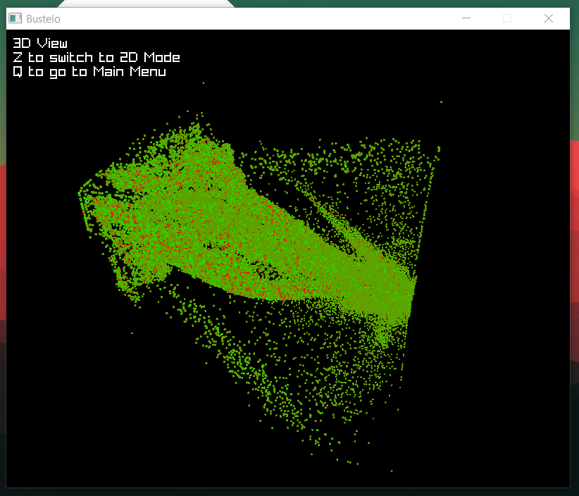
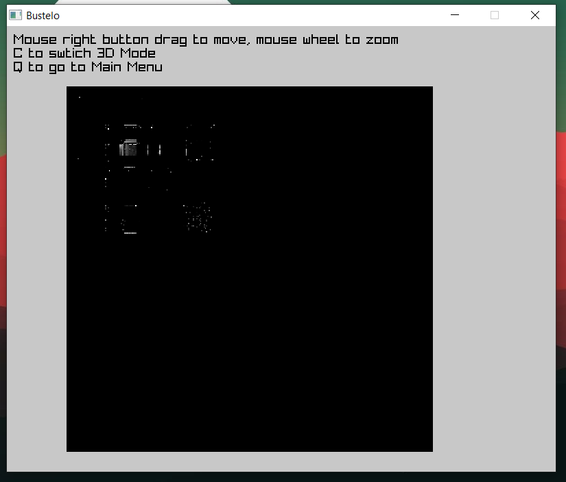
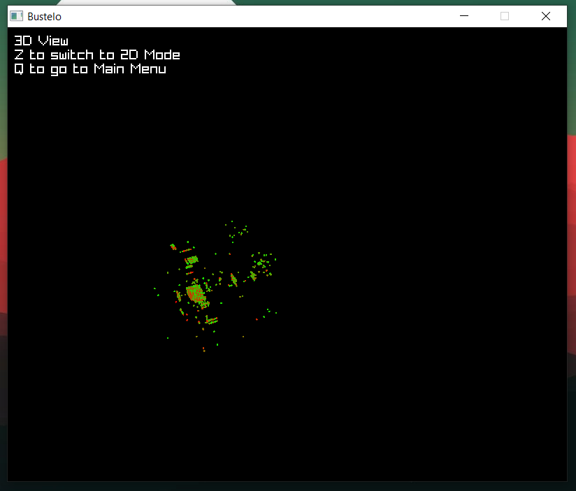
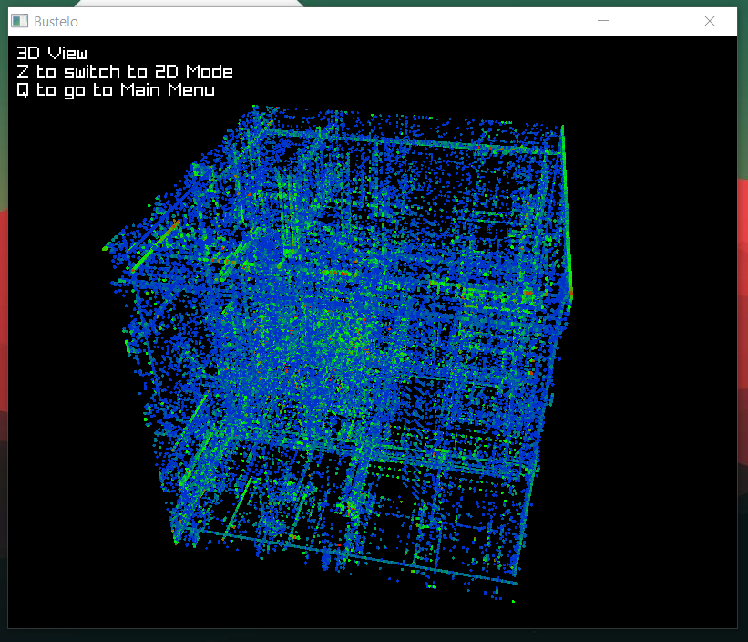
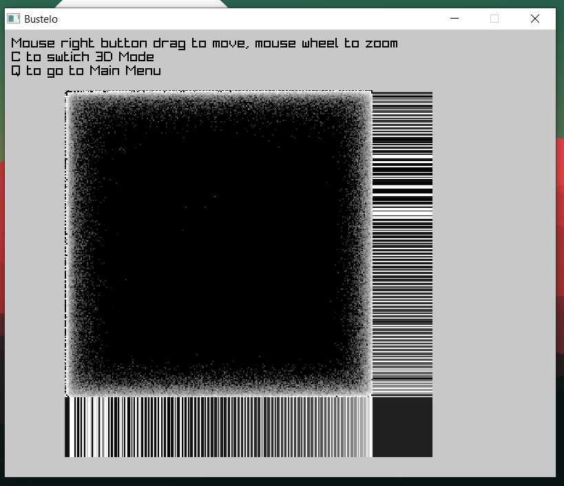
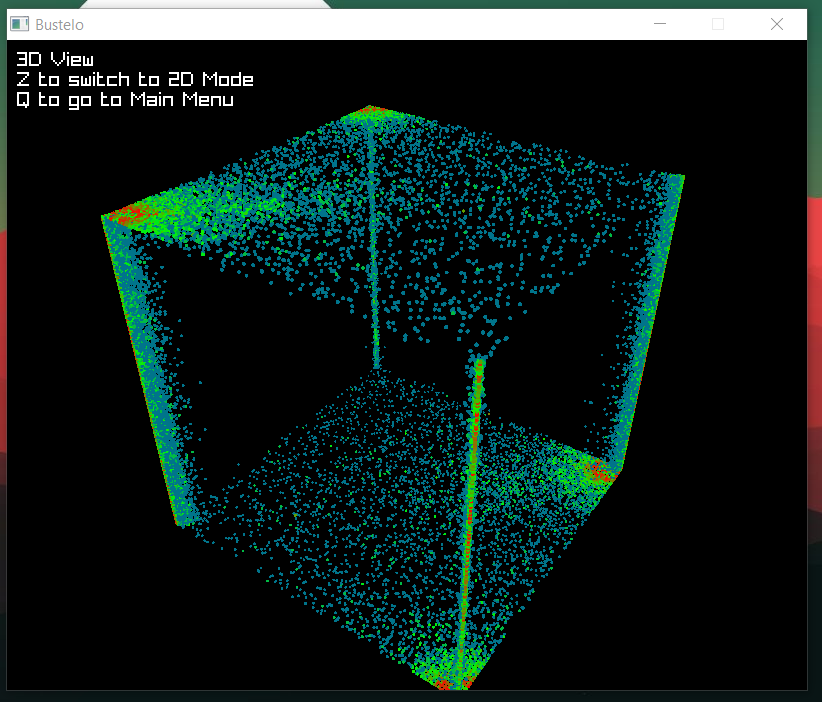
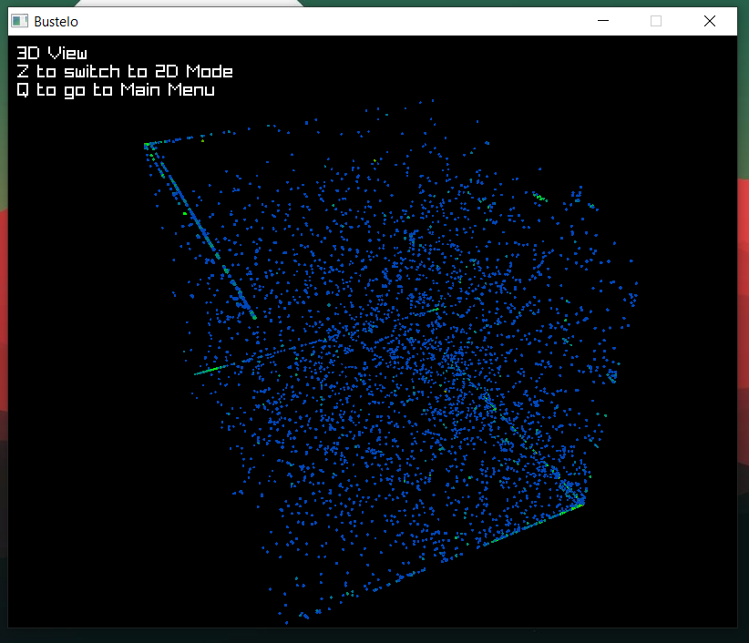

# Dynamic Binary Visualization

CLI to help find the file type of a binary and visualize it.
Might never be useful, but great excuse to go back into C after 3 years.

## Example

Bitmaps:

<p float="left">
  
   
</p>


File with text:

<p float="left">
  
   
</p>

x86 (Bustelo app on Windows):

<p float="left">
  
   
</p>

WAV:

<p float="left">
  
   
</p>

MP3:

<p float="left">
  
   
</p>

## Usage
```bash
bustelo <file>  # CLI mode
bustelo --gui   # GUI mode
```

## Dev - Setup
**Win x86**
Install Raylib & W64DevKit system wise: [Guide](https://github.com/raysan5/raylib/wiki/Working-on-Windows)
```bash
# Launch the Shell with the devkit
C:\w64devkit\w64devkit.exe

# Compile the project & run it (on git-bash - Not in the same shell)
mingw32-make
```

Dev - Linux:
Insall Raylib system wise
```bash
make
```

## Ressources:
- This repo contain my own implementation of Christopher Domas Talk: [Youtube](https://www.youtube.com/watch?v=C8--cXwuuFQ)
- Project Template: [Misha's Makefile magic](https://github.com/KRMisha/Makefile)
- Adapted for C for my own need
