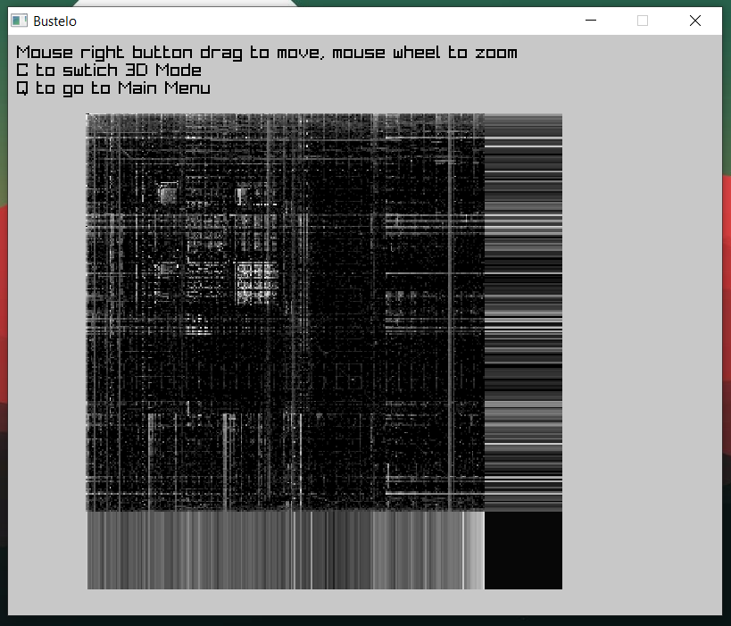
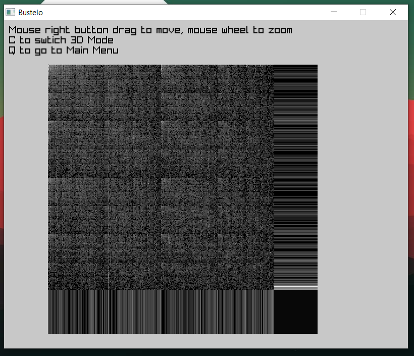

# Dynamic Binary Visualization

**[WORk IN PROGRESS]** This is unfinished Software, see bellow on what's next.

CLI & GUI tool to generate the representation of how the infomration is store in a file. This tool can allow to speed up the identification of the file format since it exist some general strcuture that are distinc on how the information is store in each file type.
Might never be useful, but great excuse to go back into C after 3 years.

## Example

Bitmaps:

<p float="left">
  
   
</p>


File with text:

<p float="left">
  
   
</p>

x86 (Bustelo app on Windows):

<p float="left">
  
   
</p>

WAV:

<p float="left">
  
   
</p>

MP3:

<p float="left">
  
   
</p>

## Usage
```bash
bustelo <file>  # CLI mode
bustelo --gui   # GUI mode
```

## Dev - Setup
**Win x86**
Install Raylib & W64DevKit system wise: [Guide](https://github.com/raysan5/raylib/wiki/Working-on-Windows)
```bash
# Launch the Shell with the devkit
C:\w64devkit\w64devkit.exe

# Compile the project & run it (on git-bash - Not in the same shell)
mingw32-make
```

**Dev - Linux**:
Insall Raylib system wise
```bash
make
```

#### TODO:
- Process the file in a separeted thread so the UI doesn't block
- It can have so many patterns (like Bitmap files), that rendering all the points becomes CPU-intensive. (Still have to do some research on the mather) Two options:
  - Pre-render the views since they won't change
  - Or offload to GPU
- Ultimate Goal: Port everything to webassembly and integrate it into a web page

## Ressources:
- This repo contain my own implementation of Christopher Domas Talk: [Youtube](https://www.youtube.com/watch?v=C8--cXwuuFQ)
- Project Template: [Misha's Makefile magic](https://github.com/KRMisha/Makefile)
  - Adapted for C for my own need
